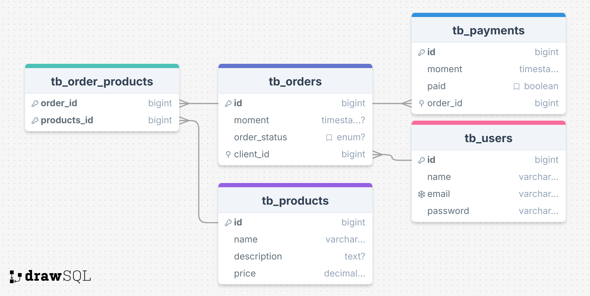

# JCrud

<p align="center">
  <a href="https://go-skill-icons.vercel.app/">
    
  </a>
</p>

O JCrud é uma api que pode ser utilizada para criar um front-end de exemplo, de forma que possui uma diagramação,estrutura, e funcionamento dado de forma documentada, e facilitada. Possuindo um total de 5 entidades, posuem diversos relacionamentos de fato que podem ser usados para entender o funcionamento da paltaforma.

## 📟 Esquema do Banco de Dados

<p align="center">
  
</p>

O projeto possui 4 entidades principais com relacionamentos bem definidos:

- **User (Usuários)**: Entidade central que representa os clientes
- **Product (Produtos)**: Itens disponíveis para venda
- **Order (Pedidos)**: Pedidos realizados pelos usuários
- **Payment (Pagamentos)**: Pagamentos associados aos pedidos

### Relacionamentos:
- **User ↔ Order**: Um usuário pode ter vários pedidos (1:N)
- **Order ↔ Payment**: Um pedido pode ter vários pagamentos (1:N)
- **Order ↔ Product**: Um pedido pode conter vários produtos (N:N)

##  🚀 Executando com Docker

### Pré-requisitos
- Docker
- Docker Compose

### Como executar

1. **Clone o repositório e navegue até a pasta do projeto:**
   ```bash
   cd jcrud
   ```

2. **Execute o comando para subir os containers:**
   ```bash
   docker-compose up --build
   ```

3. **A aplicação estará disponível em:**
   - **API**: http://localhost:8080
   - **Swagger UI**: http://localhost:8080/swagger-ui.html
   - **MySQL**: localhost:3306 (usuario: jcrud_user, senha: jcrud_password)

### Comandos úteis

```bash
# Subir os containers em background
docker-compose up -d --build

# Parar os containers
docker-compose down

# Ver logs da aplicação
docker-compose logs app

# Ver logs do MySQL
docker-compose logs mysql

# Executar comandos no container da aplicação
docker-compose exec app bash

# Executar comandos no container do MySQL
docker-compose exec mysql mysql -u jcrud_user -p jcrud_db
```

### Arquivos de configuração Docker

- **Dockerfile**: Configuração multi-stage para build e execução
- **docker-compose.yml**: Orquestração dos serviços (app + MySQL)
- **application-docker.properties**: Configurações específicas para ambiente Docker
